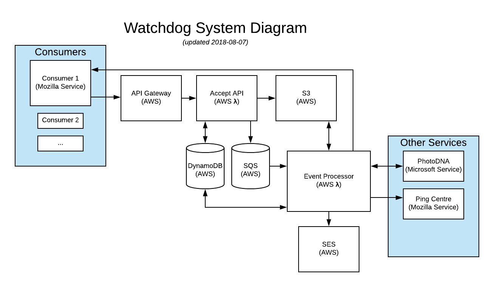

# watchdog-proxy

[](https://circleci.com/gh/mozilla/watchdog-proxy)

This is a simple proxy which interfaces with Microsoft's [PhotoDNA Service](https://www.microsoft.com/en-us/photodna).

## Systems Diagram



### Quick summary of operation

1. A third-party Consumer sends an HTTP POST request to the AWS API gateway to invoke the Accept lambda function
1. The Accept function authenticates the Consumer's credentials supplied via Hawk against a DynamoDB table
1. If the credentials & parameters are valid, details of the Consumer's submission are sent to the SQS queue and the uploaded image is saved in a private S3 bucket.
1. An Event Processor lambda function is invoked by [the AWS queue poller][poller] for each SQS message
1. The Event Processor function calls the upstream web service (i.e. PhotoDNA) with the details of a Consumer submission
1. On a response from the upstream web service, the Event Processor makes a request back to a URL included in the Consumer submission
1. Finally, on success, the Event Processor deletes the message from the SQS queue to acknowledge completion

Note: images in the S3 bucket are not currently deleted, though objects in the bucket have a 30-day expiration

[poller]: https://docs.aws.amazon.com/lambda/latest/dg/with-sqs.html

## Development

### Useful NPM scripts

- `npm run lint` - check JS syntax & formatting
- `npm run test` - run JS tests
- `npm run watch` - start a file watcher that runs tests & lint
- `npm run prettier` - clean up JS formatting
- `npm run deploy` - deploy a stack configured for production
- `npm run deploy:dev` - deploy a stack configured for development (e.g. with `ENABLE_DEV_AUTH=1`)
- `npm run info` - display information about the currently deployed stack (e.g. handy for checking the stack's API URL)
- `npm run logs -- -f accept -t` - watch logs for the function `accept`
- `npm run client -- [--id <id> --key <key> --url <url>]` - make an authenticated request, defaults to an auto-detected service URL for your stack with credentials devuser / devkey
- `npm run client -- --url https://watchdog-proxy.dev.mozaws.net` - make an authenticated request to the dev stack
- `npm run client -- --help` - see further options accepted by the client

### Quickstart Notes

First, ensure [node.js 8.11.1](https://nodejs.org/en/) or newer is installed. Then, the steps to get started look something like this:
```
git clone git@github.com:mozilla/watchdog-proxy.git
cd watchdog-proxy
npm install
npm start
```

After cloning the repository and installing dependencies, `npm start` will launch several file watchers that build assets as needed, run unit tests, and check code quality as you edit files.

For local development, create your own version of `serverless.local.yml`:
1. Copy `serverless.local.yml-dist` to `serverless.local.yml`
1. Edit `serverless.local.yml`
1. Change at least the `stage` property to a name that's unique to you

You don't need to create this file if you intend to use environment variables to configure deployment. In fact, this file will override many environment variables if you use it.

The next step is to get the service running on AWS. You'll need to [sign up for an account](https://aws.amazon.com/) or [request a Dev IAM account from Mozilla Cloud Operations](https://mana.mozilla.org/wiki/display/SVCOPS/Requesting+A+Dev+IAM+account+from+Cloud+Operations). (The latter is available only to Mozillians.)

Optional: [Install AWS CLI](https://docs.aws.amazon.com/cli/latest/userguide/installing.html). This gives you tools to work with AWS from the command line.

If you already have an AWS key ID and secret, [you can follow the quick start docs for Serverless to configure your credentials](https://serverless.com/framework/docs/providers/aws/guide/credentials#quick-setup)

If you don't already have an AWS key ID and secret, [follow the guide to acquire and configure these credentials](https://serverless.com/framework/docs/providers/aws/guide/credentials/).

Try deploying the service to AWS:
```
npm run deploy:dev
```

You should see output like the following:
```
$ npm run deploy:dev
Serverless: Packaging service...
Serverless: Excluding development dependencies...
Serverless: Creating Stack...
Serverless: Checking Stack create progress...
.....
Serverless: Stack create finished...
Serverless: Uploading CloudFormation file to S3...
Serverless: Uploading artifacts...
Serverless: Uploading service .zip file to S3 (6.39 MB)...
Serverless: Validating template...
Serverless: Updating Stack...
Serverless: Checking Stack update progress...
...........................................................................
Serverless: Stack update finished...
Service Information
service: watchdog-proxy
stage: lmorchard
region: us-east-1
stack: watchdog-proxy-lmorchard
api keys:
  None
endpoints:
  GET - https://30r00qsyhf.execute-api.us-east-1.amazonaws.com/lmorchard/accept
functions:
  accept: watchdog-proxy-lmorchard-accept
  pollQueue: watchdog-proxy-lmorchard-pollQueue
  processQueueItem: watchdog-proxy-lmorchard-processQueueItem
```

If everything was successful, you should now have a running stack with an HTTPS resource to accept requests listed as one of the endpoints. Copy the listed endpoint URL and keep it handy.

To send your first request, use the `client` script with the GET endpoint URL:
```
npm run client
```

With no options, this command should attempt to auto-detect the endpoint URL for your deployed stack. You can check to see the results of this request working its way through the stack with the following log commands:
```
# Client request is accepted into the queue
npm run logs -- -f accept
# Client request is received from the queue
npm run logs -- -f pollQueue
# Queued job is processed
npm run logs -- -f processQueueItem
# Upstream service receives a request
npm run logs -- -f mockUpstream
# Client callback service receives a negative result
npm run logs -- -f mockClientNegative
# Client callback service receives a positive result
npm run logs -- -f mockClientPositive
```

If you want to remove this stack from AWS and delete everything, run `npm run remove`

The [Serverless docs on workflow are useful](https://serverless.com/framework/docs/providers/aws/guide/workflow/).

### Custom stable domain name for local development

By default, no custom domain name is created. You can use the semi-random domain name serverless offers on deployment and with `serverless info`.

If you want to create a domain name for local development (e.g. `watchdog-proxy-lmorchard.dev.mozaws.net`):

1. Edit your `serverless.local.yml` to contain an enabled `customDomain` section with appropriate details
1. Run `npx serverless create_domain` - this only needs to be done once, to create the new custom domain name in Route53 and an accompanying CloudFront distribution
1. Run `npm run deploy:dev` to update your stack

Read this Serverless Blog post for more details: https://serverless.com/blog/serverless-api-gateway-domain/

## Deployment

### Environment variables

When using `serverless deploy` to deploy the stack, you can use several environment variables to alter configuration. Note that many of these are currently overridden by a `serverless.local.yml` file, if present.

- `STAGE` - Stage for building and deploying - one of `dev`, `stage`, or `production`
- `NODE_ENV` - Use `production` for a more optimized production build, `development` for a development build with more verbose logging and other conveniences
- `PREFIX` - a prefix string used in constructing the names of resources and functions, by default a combination of service and stage names
- `HITRATE_TABLE` - name of the DynamoDB table used for tracking rate limiting, overrides the automatically named default value
- `CREDENTIALS_TABLE` - name of the DynamoDB table containing user credentials, overrides the automatically named default value
- `QUEUE_NAME` - name of the SQS queue used to manage incoming jobs, overrides the automatically named default value
- `QUEUE_ARN` - ARN of the SQS queue used to manage incoming jobs - might seem redundant with `QUEUE_NAME`, but it's required for `production` stage to trigger the `processQueueItem` function with SQS events (done automatically for `dev` stage)
- `CONTENT_BUCKET` - name of the S3 bucket used for storing images and job results, overrides the automatically named default value
- `GIT_COMMIT` - The value reported by the `__version__` resource as `commit`. If not set, Serverless config will attempt to run the `git` command to discover the current commit.
- `EMAIL_FROM` - email address from which alerts on positive matches are sent, *must be verified in AWS SES*
- `EMAIL_TO` - email address to which all alerts on positive matches will be sent (along with positive_email parameter in requests), blank by default
- `EMAIL_EXPIRES` - number of seconds for which links in a positive alert email should remain valid, defaults to one month (2592000 seconds)
- `UPSTREAM_SERVICE_URL` - the URL of the production upstream web service (i.e. PhotoDNA)
- `UPSTREAM_SERVICE_KEY` - the private subscription key for the upstream web service
- `ENABLE_DEV_AUTH=1` - This enables a hardcoded user id / key for development (off by default)
- `DISABLE_AUTH_CACHE=1` - Authentication credentials are cached in memory in the `accept` API function. This lasts until AWS recycles the container hosting the function. Setting this variable disables the cache.
- `MOCK_POSITIVE_CHANCE` - a number from 0.0 to 1.0 representing the probability that the mock upstream endpoint will respond with a positive match
- `METRICS_URL` - Override for Ping Centre service URL used for internal metrics. By default, the stage or production Ping Centre URL is used based on `NODE_ENV`

You can see these variables used by scripts defined in `package.json` for development convenience.

#### Production deployment

For a production deployment involving just the functions and no other resources, define most resources using environment variables like so:

```
STAGE=production \
NODE_ENV=production \
PREFIX=watchdog \
HITRATE_TABLE=$PREFIX-hitrate \
CREDENTIALS_TABLE=$PREFIX-credentials \
CONTENT_BUCKET=watchdog-content \
QUEUE_NAME=$PREFIX-messages \
QUEUE_ARN=arn:aws:sqs:$AWS_REGION:$AWS_ACCOUNT_ID:$QUEUE_NAME \
UPSTREAM_SERVICE_URL=https://api.microsoftmoderator.com/photodna/v1.0/Match \
UPSTREAM_SERVICE_KEY={secret service key} \
npm run deploy
```

This should select [the `production` config settings](./config/production.yml), which defines functions but omits resources or IAM statements. So, all those dependencies should be created separately and identified via environmnent variables.

## Managing client credentials

Managing client credentials for [Hawk authentication][] is currently a manual
process of direct edits to the Credentials table in Dynamo DB - no tooling has
been created for this yet.

Each item in the Credentials table consists of these properties:

* `id` -the client's ID
* `key` - a secret key
* `algorithm` - the HMAC hash algorithm to use

The `id` and `key` properties are mandatory and should both be unique values.
Neither of these are hashed, since the Hawk algorithm requires access to them
in plaintext. The `id` value will appear in log messages and metric pings, but
`key` should remain secret.

The `algorithm` property is optional - if empty, a default of "`sha256`" will
be used. The `algorithm` used should be given to the client implementor along with
the `id` and `key`, because it is necessary as part of constructing a Hawk auth
request.

The set of alternate values for `algorithm` are described as part of the
[`crypto.createHmac` function](https://nodejs.org/api/crypto.html#crypto_crypto_createhmac_algorithm_key_options) supplied by node.js - TL;DR:

> The algorithm is dependent on the available algorithms supported by the version of OpenSSL on the platform. Examples are 'sha256', 'sha512', etc. On recent releases of OpenSSL, openssl list -digest-algorithms (openssl list-message-digest-algorithms for older versions of OpenSSL) will display the available digest algorithms.

[hawk authentication]: https://github.com/hueniverse/hawk#readme
